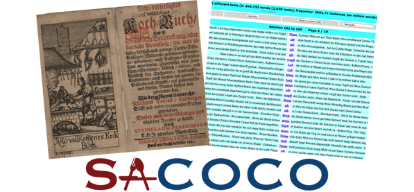

[](http://hdl.handle.net/11858/00-246C-0000-001F-7C43-1)

This tutorial will show you step-by-step how to use the CLARIN-D infrastructure to compile a diachronic corpus of German cooking recipes. Afterwards, you will learn how to exploit this resource to discover how the conative function has evolved in this genre during the last centuries.

In order to reproduce succesfully this showcase, you will need to satisfy the following requirements:

- a UNIX OS
- Python 3, and some packages (`pip3 install requirements.txt`)
    - lxml
    - pandas
    - regex
    - requests
- R
- internet connection

You also need the materials. Go to our GitHub [repo](https://github.com/chozelinek/sacoco) and clone it.

Ready? Steady! Go!

# Corpus compilation

A corpus is a collection of texts in electronic format. We distinguish three main steps in the process of compiling an electronic corpus:

1. data acquisition and preprocessing
1. linguistic annotation with WebLicht
1. corpus encoding for CQPweb

We have two different sources of data:

- contemporary
- historical

**Historical** recipes were transcribed and digitised manually by Andrea Wurm. Moreover, we completed this dataset with some transcriptions done by Glonning et al. In parallel, we obtained a set of **contemporary** recipes from a wiki site devoted to cooking recipes --`rezeptewiki.org`, today [kochwiki.org](http://www.kochwiki.org/wiki/Hauptseite). Luckily, a XML dump of this site is available at the [Internet Archive](https://archive.org/download/wiki-rezeptewikiorg).

Due to the different nature of our historical and contemporary datasets. The corpus compilation methodology althoug following a similar outline is slightly different.

## Data acquisition and preprocessing

Our goal at this stage is to obtain the data in digital form. And afterwards, preprocess the material to obtain a homogenous minimalistic TEI/XML format, that we can easily integrate in our pipeline, namely: WebLicht and CQP.

### Contemporary component

Download a wiki dump from <https://archive.org/download/wiki-rezeptewikiorg>.

```bash
# dowload the dump to the data/contemporary/source folder
wget -P data/contemporary/source https://archive.org/download/wiki-rezeptewikiorg/rezeptewikiorg-20140325-history.xml.7z
# unzip the file
7z x -odata/contemporary/source data/contemporary/source/rezeptewikiorg-20140325-history.xml.7z rezeptewikiorg-20140325-history.xml
```

The relatively small 19.8M file becomes a monster of 1.21G. This figure can give you an slight idea of the daunting task of extracting manually information from this file. We use a python script instead (`wikiextractor.py`) to automatically extract and structure the following information:

- a minimal **TEI/XML** file for each page containing:
    - title, and
    - cooking instructions
- a CSV file containing metadata for each page such as:
    - authors
    - ingredients
    - tools
    - methods
    - cuisines
    - URL
    
The input for this script is the huge file `rezeptewikiorg-20140325-history.xml`. It contains thousands of `page` nodes, its `revision`s and the actual `text`.

```xml
<page>
  <title>&quot;Krömpele&quot;-Suppe</title>
  <ns>0</ns>
  <id>46526</id>
  <sha1>rhhwusxi5j205lgcktz71ncz5s12gwu</sha1>
  <revision>
    <id>262379</id>
    <timestamp>2013-10-30T15:27:50Z</timestamp>
    <contributor>
      <username>CTHOE</username>
      <id>927</id>
    </contributor>
    <comment>Neu angelegt</comment>
    <text xml:space="preserve" bytes="1851">{{Rezept|
 | Menge         = 4 Personen
 | Zeit          = 30–40 Minuten
 | Schwierigkeit = leicht
 | Alkohol       = nein
 | Vegetarisch   = nein
 | Bild          = Kein_Bild.png
|}}

== Zutaten ==
* 175 g [[Zutat:Mehl|Mehl]], gesiebt
* 2–3 [[Zutat:Ei|Eier]]
* 1 Pr. [[Zutat:Salz|Salz]]
* 500 ml [[Zutat:Fleischbrühe|Fleischbrühe]]
* 250 g [[Zutat:Schinkenspeck|Schinkenspeck]]
* frisch geriebener [[Zutat:Muskat|Muskat]]
* 2–3 EL [[Zutat:Schnittlauch|Schnittlauch]]

== Kochgeschirr ==
* 1 [[Zubereitung:Küchenbrett|Küchenbrett]]
* 1 [[Zubereitung:Topf|Topf]]
* 1 [[Zubereitung:Pfanne|Pfanne]]

== Zubereitung ==
* Schnittlauch in kleine Röllchen [[Zubereitung:schneiden|schneiden]]
* Gewürze, Mehl und Eier mit etwas Wasser zu einem dickflüssigen Teig verrühren
* Unter Umständen muss etwas Mehl oder Wasser dazugegeben werden, um die richtige Konsistenz des Teiges zu erreichen
* Den Teig zu großen ''Krömpele'' (Krümel) mit den Händen verreiben
* Etwa 1 l Wasser mit der Brühe [[Zubereitung:aufkochen|aufkochen]]
* Hierin die ''Krömpele'' leicht [[Zubereitung:köcheln|köchelnd]] in etwa 15 Minuten [[Zubereitung:garziehen|garziehen]] lassen
* Zwischenzeitlich den Speck fein [[Zubereitung:würfeln|würfeln]] und goldbraun [[Zubereitung:ausbraten|ausbraten]]
* Speckwürfel in die Suppe schütten, [[Zubereitung:abschmecken|abschmecken]] und mit reichlich Schnittlauchröllchen [[Zubereitung:garnieren|garnieren]] und [[Zubereitung:anrichten|anrichten]]

[[Kategorie:Thüringer Küche]]
[[Kategorie:Nocken]]
[[Kategorie:Vorspeisen]]
[[Kategorie:Suppen]]</text>
  </revision>
</page>  
```

The script does the following:

1. opens the input XML file
1. gets all `page` nodes
1. filters those recipes corresponding to German speaking regions only
1. for each of those recipes gets the last revision
1. extracts:
    1. revision ID
    1. page ID 
    1. year of last revision
    1. cuisine
    1. authors
    1. ingredients
    1. tools
    1. methods
    1. title
    1. text with the instructions
1. title and text are saved as a TEI XML file (`data/source/tei`)
1. metadata are saved in a CSV file (`data/metadata/wiki-metadata-textid.csv`)

To run the script you need to run the following commands from the terminal:

```bash
# run the script
python3 wikiextractor.py -i data/source/wiki-rezeptewikiorg/rezeptewikiorg-20140325-history.xml -x data/contemporary/tei - data/metadata
```

> TIP: for development/testing purposes, if you just run `python3 wikiextractor.py`, it will work on the testing dataset stored in the `test` folder.

This is one of the TEI files `wiki_188908.xml`:

```xml
<?xml version='1.0' encoding='UTF-8'?>
<?xml-model href="http://www.tei-c.org/release/xml/tei/custom/schema/relaxng/tei_lite.rng" type="application/xml" schematypens="http://relaxng.org/ns/structure/1.0"?>
<TEI xmlns="http://www.tei-c.org/ns/1.0" xml:lang="de">
  <teiHeader>
    <fileDesc>
      <titleStmt>
        <title>Räucherfischmousse im Knusperröllchen auf Gurken-Rahmsalat</title>
        <author>Qualia, Jozeil, NikiWiki</author>
        <respStmt>
          <resp/>
          <name/>
        </respStmt>
      </titleStmt>
      <publicationStmt>
        <publisher>Universität des Saarlandes</publisher>
        <pubPlace>Saarbrücken</pubPlace>
        <availability status="free">
          <p>Published under a <ref target="http://creativecommons.org/licenses/by-sa/3.0/">Creative Commons Attribution ShareAlike 3.0 License</ref>.</p>
        </availability>
        <date>2016</date>
      </publicationStmt>
      <sourceDesc>
        <p>http://www.kochwiki.org/w/index.php?oldid=188908</p>
      </sourceDesc>
    </fileDesc>
  </teiHeader>
  <text xml:id="wiki_188908">
    <body>
      <div n="1" type="recipe">
        <head>Räucherfischmousse im Knusperröllchen auf Gurken-Rahmsalat</head>
        <div n="2" type="contents">
          <head>Räucherfischmousse</head>
          <p>Das Saiblingsfilet entgräten und in grobe Stücke schneiden. Den Fischfond in einem Topf aufkochen. Die Speisestärke in wenig Wasser glatt rühren, den Fond damit abbinden und auskühlen lassen. Dann die Flüssigkeit mit den Räucherfischstücken in den Mixaufsatz der Küchenmaschine füllen und pürieren "(Falls kein Mixaufsatz oder Küchenmaschine vorhanden einen Zauberstab verwenden)". Die Gelatine in kaltem Wasser einweichen. Einen Topf mit zwei EL Wasser erwärmen und die gut ausgedrückte Gelatine darin auflösen. Während dessen die Schlagsahne halb fest aufschlagen. Die Fischmasse in eine Schüssel füllen und mit der Gelatine sowie etwa der Hälfte des Schlagobers gut vermengen. Dann die restliche Schlagsahne locker unterheben. Das Räucherfischmousse mit Salz sowie Pfeffer abschmecken. Die fertige Fischfüllung mit Klarsichtfolie abdecken und für mindestens 1/2 Stunde im Kühlschrank kalt stellen.</p>
        </div>
        ...
      </div>
    </body>
  </text>
</TEI>

```

And this is just an example of a few instances of the metadata file:

| | source | year | title | authors | categories | ingredients | methods | tools
---|---|---|---|---|---|---|---|---
wiki_142256 | wiki | 2010 | Salziger Wähenteig mit saurer Sahne | Vran01, Jozeil | Schweizer Küche | Sahne, Salz, Mehl, Butter |  | Schüssel, Küchenwaage, Frischhaltefolie
wiki_150044 | wiki | 2010 | Punschglasur | Jozeil | Österreichische Küche | Eiweiß, Zucker, Orangensaft, Rum | Glasieren | Schüssel, Schneebesen
wiki_158731 | wiki | 2010 | Riebelesuppe | Vran01, Hombre, Jozeil, Daniel Beyer | Schwäbische Küche | Weizenmehl, Brühwürfel, Ei, Salz, Pfeffer, Meersalz | Abschmecken | Schüssel, Topf, Küchenreibe

You can check from the commandline if the TEI files are alright:

```bash
for i in data/contemporary/tei/*.xml; do xmllint --noout --relaxng utils/tei_lite.rng $i; done
```

> TIP: for development/testing purposes, just switch the input folder:
```bash
for i in test/contemporary/tei/*.xml; do xmllint --noout --relaxng utils/tei_lite.rng $i; done
```

### Historical component


## Data processing with WebLicht

In the previous section, we have seen how to *shape* our data for ulterior stages. Once that we have a homogenous format for both collections, it is time to process the texts with **WebLicht**.

At this point, we still have to work separately with the contemporary and historical collections. In both cases, we will perform these steps:

1. design a chain in WebLicht
    1. authenticate
    1. build a tool chain
1. process all recipes with this chain using WaaS
    1. get an API key for WaaS
    1. use a python wrapper to interact with WebLicht

### Logging into WebLicht

We use the Shibboleth Authentication service to log in WebLicht. We will need an identity from a CLARIN identity provider. If your institution is not such a provider you can request an account from the CLARIN provider.

1. Visit the [WebLicht Wiki](http://weblicht.sfs.uni-tuebingen.de/weblichtwiki/index.php/Main_Page), scroll down to the bottom of the page and click on the blue button to `Start WebLicht`.
1. The Shibboleth Authentication service will load. Choose your identity provider (`clarin.eu website account` if you are using a CLARIN account).
1. You will be redirected to an institutional page where you have to provide your user and password.
1. If everything is OK, WebLicht's welcome page will be loaded.

This video prepared by our colleagues at Tübingen precisely illustrate the logging process:

<video width="640" height="360" autobuffer controls preload="auto"><source src="http://weblicht.sfs.uni-tuebingen.de/weblichtwiki/extensions/HTML5video/videos/WebLichtLogin.mp4" type="video/mp4"/><source src="http://weblicht.sfs.uni-tuebingen.de/weblichtwiki/extensions/HTML5video/videos/WebLichtLogin.ogv" type="video/ogg"/><source src="http://weblicht.sfs.uni-tuebingen.de/weblichtwiki/extensions/HTML5video/videos/WebLichtLogin.webm" type="video/webm"/></video>

If you run into problems, read the [FAQ explaining how to loggin into WebLicht](http://weblicht.sfs.uni-tuebingen.de/weblichtwiki/index.php/FAQ#Logging_In).

### Building the tool chain to process contemporary data

1. Click on `New Chain`.
1. A window will pop-up.
1. There are 3 input modes: click on the leftmost box where one can read `Enter your text here.` and paste this contemporary recipe excerpt: `Das Mehl in die Schüssel geben (eventuell sieben), in der Mitte eine Mulde eindrücken. Die saure Sahne hinein geben und mit Salz bestreuen.`
1. Choose the `Document Type`: `Plain Text`.
1. Choose the `Language`: `German`.
1. Click on OK.
1. Now, you have to choose a mode: pick `Advanced Mode`.
1. Choose the tools:
    1. Berlin: Plaintext Converter
    1. Berlin: Tokenizer and Sentence
    1. Berlin: Part-of-Speech Tagger
1. Click on `Run Tools`
1. Explore the results
1. Download the chain by clicking on `Download chain`
1. Save the XML file as `chain_contemporary_deu.xml` in the folder `../scripts` of our repo.

If the instructions weren't clear enough, watch this video explaining how to design a tool chain.

<video width="640" height="360" autobuffer controls preload="auto"><source src="http://weblicht.sfs.uni-tuebingen.de/weblichtwiki/extensions/HTML5video/videos/SimpleToolChain.mp4" type="video/mp4"/><source src="http://weblicht.sfs.uni-tuebingen.de/weblichtwiki/extensions/HTML5video/videos/SimpleToolChain.ogv" type="video/ogg"/><source src="http://weblicht.sfs.uni-tuebingen.de/weblichtwiki/extensions/HTML5video/videos/SimpleToolChain.webm" type="video/webm"/></video>

### Building the tool chain to process historical data

The process is exactly the same as we used before.

1. Click on `New Chain`.
1. A window will pop-up.
1. There are 3 input modes: click on the leftmost box where one can read `Enter your text here.` and paste this contemporary recipe excerpt: `Das Mehl in die Schüssel geben (eventuell sieben), in der Mitte eine Mulde eindrücken. Die saure Sahne hinein geben und mit Salz bestreuen.`
1. Choose the `Document Type`: `Plain Text`.
1. Choose the `Language`: `German`.
1. Click on OK.
1. Now, you have to choose a mode: pick `Advanced Mode`.
1. Choose the tools:
    1. Berlin: Plaintext Converter
    1. Berlin: Tokenizer and Sentence
    1. Berlin: CAB historical text
1. Click on `Run Tools`
1. Explore the results
1. Download the chain by clicking on `Download chain`
1. Save the XML file as `chain_historical_deu.xml` in the folder `../scripts` of our repo.

### Using WebLicht as a service

We could process our texts directly through the user-friendly WebLicht GUI. However, we have thousands of recipes to be processed. That would be a formidable amount of time wasted in a repetitive task. Fortunately, WebLicht developers devised [**WaaS**](https://weblicht.sfs.uni-tuebingen.de/WaaS/).

> WebLicht as a Service (WaaS) is a REST service that executes WebLicht chains. This allows you to run WebLicht chains from your UNIX shell, scripts, or programs.

It means that we can write a script to automatize our interaction with WebLicht! (Sigh of relief!)

We need at least two things:

1. a WebLicht chain
1. an API key

The first item is already solved. For the second, go to the [WaaS home page](https://weblicht.sfs.uni-tuebingen.de/WaaS), click on the rigthmost menu item at the top of the page called `API Key`. You will be redirected to the already familiar authentication page, choose your institution (`clarin.eu website account` for us), provide your credentials and a new page will load. If you hit on the button `Generate` a long string will appear where it reads `Your API key`. Copy the key in a safe place.

Time to actually process our XML files with `WaaS`!

### Processing the contemporary recipes

We have created a python script to process the recipes with WaaS (`weblichtwrapper.py`).

The goal of the script is to process all TEI/XML files in a folder with WebLicht and save the results in VRT files for their ulterior encoding as a corpus for the Corpus WorkBench (CWB).

The input is tipically a folder with the TEI/XML files we created in previous sections. But in fact we could use any XML file.

The script does the following:

1. obtention of a list of all files to be transformed
1. find all nodes containing text to be processed
1. send to WaaS a request to process the text of a node with the provided chain
1. convert the WaaS response in TCF format to VRT
1. saves the VRT files in the target directorys

To run the script you need to invoke the following commands from the terminal

```bash
python3 weblichtwrapper.py -i data/contemporary/tei -c utils/chain_contemporary.xml -o data/contemporary/vrt
```

Then, you will be prompted to provide your API key.

> TIP: for development/testing purposes, if you just run `python3 weblichtwrapper.py -c chain_contemporary`, it will work on the testing dataset stored in the `test` folder.

You can get more information on the parameters this script takes by running:

```bash
python3 weblichtwrapper.py -h
```

The output is a VRT file (one token per line and positional attributes separated by a tabulation).

```xml
<?xml version='1.0' encoding='UTF-8'?>
<text id="wiki_244969">
<p>
<s>
Das	ART	d
Brot	NN	Brot
in	APPR	in
ca.	ADV	ca.
1	CARD	1
cm	NN	Cm
große	ADJA	groß
Würfel	NN	Würfel
schneiden	VVFIN	schneiden
.	$.	.
</s>
<s>
Die	ART	d
Sonnenblumenkerne	NN	Sonnenblumenkern
in	APPR	in
einer	ART	eine
Pfanne	NN	Pfanne
ohne	APPR	ohne
Öl	NN	Öl
anrösten	VVINF	anrösten
und	KON	und
fein	ADJD	fein
reiben	VVINF	reiben
.	$.	.
</s>
...
<s>
Mit	APPR	mit
Sonnenblumenkernen	NN	Sonnenblumenkern
,	$,	,
Stachelbeeren	NN	Stachelbeere
sowie	KON	sowie
Minze	NN	Minze
garnieren	VVINF	garnieren
und	KON	und
heiß	ADJD	heiß
servieren	VVINF	servieren
.	$.	.
</s>
</p>
</text>
```

### Processing the historical recipes

The procedure is exactly the same, the only differences are: the location of the input files, and the chain to be used.

```bash
python weblichtwrapper.py -i ../data/source/xml/ -c chain_historical_deu.xml
```

## Corpus encoding for CQPweb

We are going to encode our corpus for the [IMS Open Corpus WorkBench](http://cwb.sourceforge.net) (a tool initially developed at IMS Stuttgart). This tool will allow us to query the corpus making the most of the annotation we have obtained with WebLicht.

The CWB expects XML files where two kind of attributes can be added:

- structural (equivalent to XML attributes, and they affect to regions of tokens)
- positional, to add multiple layers of information at token level

In the previous section we created the VRT files with the required positional information. Now, we will complete the annotation by adding structural attributes to the text element from the metadata we stored in a CSV file.

### Add the metadata to the VRT files

To add the metadata as structural attributes we need:

- VRT files
- metadata as CSV
- a script

We use `addmetadata.py` Python script by running the following command:

```bash
python3 addmetadata.py -i data/contemporary/vrt -m data/metadata/sacoco-metadata.csv -o data/contemporary/meta
```

The script does the following:

1. obtention of a list of all files to be transformed
1. parsing of the metadata
1. finding all nodes where the metadata fields will be added as attributes
1. adding to each node its corresponding metadata using the `text id` as key
1. saving the VRT files in the target directory

We should see something like this:

```xml
<?xml version='1.0' encoding='UTF8'?>
<text id="wiki_200141" year="2011" period="2000" authors="NikiWiki|Hombre|Jozeil" decade="2010" title="Bärlauchnockerl" methods="hacken|Abschmecken|anrichten" ingredients="Muskatnuss|Pfeffer|Sauerrahm|Salz|Schmand|Bärlauch|Gelatine" collection="contemporary" cuisines="Oberösterreichische Küche" source="wiki" tools="Küchenreibe|Schlagkessel|Schüssel|Frischhaltefolie|Schneidebrett|Löffel|Messer|Zauberstab|Küchenmaschine">
<p>
<s>
Den	ART	d
Bärlauch	NN	Bärlauch
fein	ADJD	fein
hacken	VVINF	hacken
.	$.	.
</s>
...
</p>
</text>
```

### Concatenate all texts in a single corpus VRT file

```bash
texts2corpus.py -i data/contemporary/meta -o data/sacoco.vrt
```

### Encode the data for CWB

Once we have the texts in VRT format, encoding the corpus for the CWB is relatively easy.

Check that you have the corpus work bench installed in the computer, if not, download it and follow these [instructions](http://cwb.sourceforge.net/download.php). We compiled from source version 3.4.8.

Now, run the following command:

```bash
# create the target folder for encoded data
mkdir -p ../data/encoded/sacoco/data
# run the command
cwb-encode -c utf8 -d ../data/encoded/sacoco/data -F ../data/source/vrt/ -R ../data/encoded/sacoco/sacoco -xsB -S text:0+id+collection+source+url+year+decade+period+title+authors/+cuisine/+ingredients/+methods/+tools/ -S p:0 -S s:0 -P pos -P lemma -P norm
# generate the registry file
cwb-make -r ../data/encoded/sacoco -V SACOCO
```

The `cwb-encode`'s parameters explained:

- `-c` to the declare the character encoding
- `-d` path to the target directory were the output will be stored
- `-F` path to the input directory were the VRT files are located
- `-R` path to the registry file
- `-xSB`
    - `x`
    - `S`
    - `B`
- `-S` to declare a structural attribute, example:
    - `-S text:0+id+authors/`
    - `text`, structural attribute to be declared
    - `0` embedding levels
    - `id` will be an attribute of `text` containing some value
    - `authors/` is also an attribute of `text` but the slash tells `cqp` to treate it as a feature set.
- `-P` to declare positional attributes

Get extensive information on how to encode corpora for the CWB in the [encoding tutorial](http://cwb.sourceforge.net/files/CWB_Encoding_Tutorial.pdf).

### Set up a corpus in CQPweb

Setting up the corpus for the CQPweb is probably the most involved step described in this tutorial. It is difficult to provide a step-by-step guide, because many things will depend on the server configuration where your CQPweb installation is living. Nevertheless, we provide our procedure below.

There are basically two ways to install a corpus in CQPweb

- by encoding the corpus directly in CQPweb
- by uploading an already encoded corpus and its registry file

You need:

- a corpus encoded for CQP + registry file
- a metadata file (optional, but very useful!)

#### The meta-data file

The meta-data file is a tab-deliminated file listing categories for each text included in the corpus. These categories can later be used in CQPweb for frequency distribution, etc. It can easily be generated using cqp (see below). An example meta-data file for {{:resources:tools-howtos:dass.txt|DaSciTex-Small}}.

- the first column is reserved for the text_id 
- the only category that must have a correspondence in the encoded corpus
- values are //handles// and may only include the following characters: 
- besides, there is no limit to type and number of categories
- they do not need a corresponding structure annotated in the corpus!
- values do not have to follow the standards for //handles//, but only those that do can be used in the distribution function!
- metadata encoded as feature sets cannot be described as "Classification" but as "Free text" because the "|" is not a valid character.

You can generate a meta-data file from a CQP corpus using the cqp command-line tool:

```bash
<text>[];
tabulate Last match text_id, match text_..., ... >"corpus.meta";
```
      
#### Upload files

There are basically two possibilities:

- via CQPweb Interface -> needs superuser rights on CQPweb; 
    - recommended if you have only a few files to upload
    - you can only upload one file at a time -> this makes it rather undesirable to upload an encoded corpus including a whole bunch of files . Zip or tar files (of whole directories) can be uploaded but not decompressed.
- via ssh -> needs root rights on the underlying server; 
    - recommended if you have a whole set of files to upload

##### Upload via CQPweb

- concatenate all XML texts using the cat command

```bash
cat *.vrt > ../
```

- CQPweb Sysadmin Control Panel -> Uploads -> Upload a file
- follow the instructions

##### Upload via ssh

- needs root permission on the server
- directory for encoded corpora: /data2/cqpweb/indexed
- registry directory: /data2/cqpweb/registry
- once you uploaded all necessary file make sure that the permissions are as follows:
    - owner: wwwrun 
    - group: www
- make sure that the registry-file has the correct path!!

#### Installing the corpus

- CQPweb Sysadmin Control Panel -> Corpora -> Install a new corpus
- follow the instructions
- The syntax for s-attributes is the same as on the command line: e.g. struc:0+feat1+feat2 (ignore the error message!!!)
- certain attributes are annotated automatically and do not have to be specified (see instructions in the form)

##### Installing an already encoded corpus

- now you are ready to install the corpus via CQPweb
- Click on the link for corpora already indexed in CWB and follow the instructions
- after successfully installing the corpus, you may want to use some of the Admin tools to adjust a few settings for the corpus

#### Admin tools

- Corpus settings: probably nothing to do here; has been set during the installation process
- Manage access: to add user groups for your corpus (otherwise only the superuser can access the corpus!)
- Manage metadata: probably nothing to do here; has been set during the installation process
- Manage text categories: here you can add more "speaking" descriptions for your text categories
- Manage annotation: add descriptions / URLs of documentations for your positional attributes; specify primary/secondary/... annotations for the CQP Simple Query language; specifying annotations here makes them available for restrictions throughout CQPweb (e.g. for the collocation function)
- Manage priviliges: Scroll to end of page and generate default privileges for the corpus; select than "Manage group grants", scroll to end of page and select a group and grant it privileges of that particular corpus (normally normal privileges are choosen)

## Integration of the resource in the CLARIN-D infrastructure

We have created our resource. Now, we can *clarinify* it by:

- getting a [PID](http://www.clarin.eu/content/persistent-identifiers) (Persistent IDentifier) for the corpus
- providing the metadata in [CMDI](http://www.clarin.eu/node/3219) format
- depositing the data and the metadata in a [repository](http://www.clarin.eu/content/depositing-services)
- making it harvestable by the [VLO](http://www.clarin.eu/content/virtual-language-observatory)
- aggregating it to the [FCS](http://weblicht.sfs.uni-tuebingen.de/Aggregator/)

The Universität des Saarlandes as a CLARIN Centre B has the staff and the resources to help you *clarinify* your data. Check [how to deposit data in our repository](http://fedora.clarin-d.uni-saarland.de/depositors.en.html).

Afterwards, your data will be like SaCoCo:

- deposited in a DSA awarded [repository](http://fedora.clarin-d.uni-saarland.de/index.en.html)
- findable in the [VLO](https://vlo.clarin.eu/search?2&q=sacoco)
- searchable through [Federated Content Search](http://weblicht.sfs.uni-tuebingen.de/Aggregator/)
- citable thanks to its PID [hdl:11858/00-246C-0000-001F-7C6F-1](http://hdl.handle.net/11858/00-246C-0000-001F-7C43-1)

# Corpus exploitation

Our diachronic corpus of cooking recipes in German is now ready to be used. We will proceed as follows:

1. We will pose our research question.
1. We will design the operationalisation of this research question.
1. We will actually extract the features with CQPweb.
1. We will visualize and analyse the data with CQPweb/R.
1. We will describe very briefly our corpus with CQPweb/R.

## Research question

> Has the realisation of the conative function evolved along the time in the cooking recipe register?

We think that this register has evolved. Our hypothesis is:

> Contemporary cooking recipes show lower linguistic means to address directly to the reader than historical ones.

## Operationalisation

> In research design, [...] operationalization is a process of defining the measurement of a phenomenon that is not directly measurable, though its existence is indicated by other phenomena.

We know that German can use different means to convey the conative function. Among them we can trace pronominal and verbal cues:

- pronominal
    - second person personal pronouns (direct)
    - indefinite pronouns (indirect)
- verbal
    - imperatives (direct)
    - infinitives (indirect)

The next step is to design how we can retreive this features in a systematic and effective way making use of the linguistic annotaton we have added with WebLicht.

Basically, we will quantify how many instances of these features we can find per text. Firt, we need to find the instances, then, we will count them. And, finally, we will describe the results and check if historical recipes significantly differ from their contemporary counterparts.

### Personal pronouns

second person pronouns

- irreflexives Personalpronomen
- substituirendes Possessivpronomen
- attribuirendes Possessivpronomen
- reflexives Personalpronomen

### Indefinite pronouns

- substituierendes Indefinitpronomen

### Imperatives

- imperatives

### Infinitives

- infinitives: VVINF (full verb infinitives), VAINF (auxiliary verb infinitives), VMINF (modal verb infinitives)

## Feature extraction

### Queries

<!-- queries -->

<!-- macros -->

### CQPweb: query, explore, export

<!-- step-by-step sequence -->

## Visualization and analysis of results

<!-- putting all together with R -->

## Corpus description

<!-- We can show this with CQPweb -->

# Bibliography

<https://en.wikipedia.org/wiki/Operationalization>